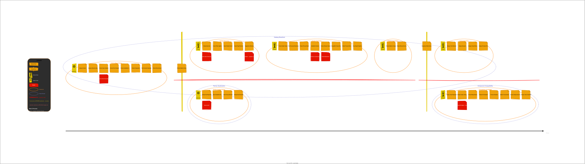

# Catalog Storefront — Event Storming Canvas

> **Subdomain:** Catalog Storefront
> **Format:** Big Picture Event Storming
> **Status:** Draft

---

## Reading Guide

- **Domain Events** (orange) — Things that happened, past tense
- **Commands** (blue) — Actions that trigger events
- **Aggregates** (yellow) — Entities that process commands and emit events
- **Actors** (small yellow) — Who issues the command
- **Read Models** (green) — Views/projections consumed by actors
- **External Systems** (pink) — Systems outside this domain
- **Policies** (lilac) — "Whenever X happens, then Y" automation rules
- **Pivotal Events** (orange with red border) — Events that mark phase transitions or boundary shifts

---

## Event Storming Canvas (draw.io)

Open the full interactive diagram in VS Code with the draw.io extension:

**[event-storming.drawio](event-storming.drawio)**

The canvas contains all 40 domain events, commands, aggregates, actors, read models, policies, and hotspots — organized by bounded context with clear boundary identification.

---

## Visual Timeline



---

## Timeline: Left → Right

### 1. Catalog Management (upstream — feeds our domain)

```
[External: Catalog Admin]

Command: Add Product to Catalog
Aggregate: Product
  → Event: Product Added to Catalog ⭐ PIVOTAL

Command: Update Product Specifications
Aggregate: Product
  → Event: Product Specifications Updated

Command: Update Product Pricing
Aggregate: Product
  → Event: Product Price Changed

Command: Upload Technical Document
Aggregate: Technical Document
  → Event: Technical Document Uploaded

Command: Discontinue Product
Aggregate: Product
  → Event: Product Discontinued ⭐ PIVOTAL

Command: Restock Product
Aggregate: Product
  → Event: Product Availability Changed

Command: Create Category
Aggregate: Category
  → Event: Category Created

Command: Reorganize Category Hierarchy
Aggregate: Category
  → Event: Category Hierarchy Updated

Command: Assign Product to Category
Aggregate: Product
  → Event: Product Categorized
```

**Policy:** Whenever Product Added to Catalog → Index Product for Search
**Policy:** Whenever Product Specifications Updated → Reindex Product for Search
**Policy:** Whenever Product Specifications Updated → Update Compatibility Rules Cache
**Policy:** Whenever Product Discontinued → Remove from Active Search Index
**Policy:** Whenever Product Price Changed → Notify Partner Feed Cache

---

### 2. Product Discovery (JS1)

```
[Actor: Professional Integrator / Fleet Buyer / Casual Browser]
[Read Model: Search Results]

Command: Search Catalog
Aggregate: Search Index
  → Event: Catalog Searched

Command: Apply Specification Filters
Aggregate: Search Index
  → Event: Search Filters Applied

Command: Sort Search Results
Aggregate: Search Index
  → Event: Search Results Sorted

Command: Request Next Page
Aggregate: Search Index
  → Event: Search Page Retrieved

Command: Request Autocomplete Suggestions
Aggregate: Search Index
  → Event: Suggestions Retrieved
```

**Read Model:** Search Results (query, filters, sorted product summaries, pagination)
**Read Model:** Autocomplete Suggestions (terms, categories, products)

---

### 3. Product Evaluation (JS2)

```
[Actor: Professional Integrator / Fleet Buyer]
[Read Model: Product Detail View]

Command: View Product Details
Aggregate: Product
  → Event: Product Details Viewed

Command: Download Technical Document
Aggregate: Technical Document
  → Event: Technical Document Downloaded

Command: Check Product Pricing
Aggregate: Product
  → Event: Product Pricing Viewed

Command: Check Product Availability
Aggregate: Product
  → Event: Product Availability Checked

Command: View Product Reviews
Aggregate: Review
  → Event: Product Reviews Viewed

Command: Browse Compatible Products
Aggregate: Product
  → Event: Compatible Products Retrieved

Command: Browse Similar Alternatives
Aggregate: Product
  → Event: Similar Products Retrieved

Command: Browse Frequently Bought Together
Aggregate: Product
  → Event: Frequently Bought Together Retrieved
```

**Read Model:** Product Detail (full specs, images, pricing, availability, documents)
**Read Model:** Related Products (compatible, similar, frequently bought together)

**Policy:** Whenever Product Details Viewed → Track View for Analytics
**Policy:** Whenever Technical Document Downloaded → Log Download for Compliance Audit

---

### 4. Product Comparison (JS3)

```
[Actor: Professional Integrator / Fleet Buyer]
[Read Model: Comparison Matrix]

Command: Add Product to Comparison
Aggregate: Comparison
  → Event: Product Added to Comparison

Command: Remove Product from Comparison
Aggregate: Comparison
  → Event: Product Removed from Comparison

Command: Generate Comparison Matrix
Aggregate: Comparison
  → Event: Comparison Matrix Generated
```

**Read Model:** Comparison Matrix (shared specs, differing specs, side-by-side values)

**Note:** Comparison Matrix Generated was initially considered pivotal (exploring → deciding), but was downgraded during validation — it lacks the cascading downstream impact and cross-boundary significance of the other pivotal events. The comparison is a step in evaluation, not a phase transition.

---

### 5. Compatibility Verification (JS4) — SEPARATE BOUNDED CONTEXT

```
[Actor: Professional Integrator / Fleet Buyer]
[Read Model: Compatibility Report]

Command: Submit Component Set for Verification
Aggregate: Compatibility Check
  → Event: Compatibility Check Requested

  [Internal processing — rule engine evaluates:]
  → Event: Voltage Compatibility Evaluated
  → Event: Current Rating Compatibility Evaluated
  → Event: Physical Fit Compatibility Evaluated
  → Event: Protocol Compatibility Evaluated
  → Event: Weight/Thrust Compatibility Evaluated

  → Event: Compatibility Check Completed ⭐ PIVOTAL
      (status: pass | fail | partial)

Command: Request Compatible Replacements
Aggregate: Compatibility Check
  → Event: Compatible Replacements Retrieved
```

**Read Model:** Compatibility Report (pass/fail, incompatibility details, severity, replacement suggestions)

**Policy:** Whenever Compatibility Check Completed (fail) → Suggest Compatible Replacements
**Policy:** Whenever Compatibility Check Completed → Log Check for Analytics

**Hotspot 🔥:** Compatibility rule management — who maintains the rules? How are new component types added? This is a separate concern from the check itself.

---

### 6. Catalog Browsing (JS5)

```
[Actor: Casual Browser / Professional Integrator]
[Read Model: Category Navigation]

Command: Request Category Tree
Aggregate: Category
  → Event: Category Tree Retrieved

Command: Browse Category
Aggregate: Category
  → Event: Category Browsed

Command: Request Category Facets
Aggregate: Category
  → Event: Category Facets Retrieved

Command: Filter Category Products
Aggregate: Category
  → Event: Category Products Filtered
```

**Read Model:** Category Navigation (hierarchy, product counts, available facets)

---

### 7. Partner Catalog Access (JS6) — SEPARATE BOUNDED CONTEXT

```
[Actor: Partner System]
[Read Model: Catalog Feed]

Command: Request Catalog Feed
Aggregate: Catalog Feed
  → Event: Catalog Feed Generated ⭐ PIVOTAL

Command: Request Batch Availability
Aggregate: Catalog Feed
  → Event: Batch Availability Retrieved

Command: Request Batch Pricing
Aggregate: Catalog Feed
  → Event: Batch Pricing Retrieved
```

**Read Model:** Partner Catalog Feed (simplified product projections, bulk data)

**Policy:** Whenever Product Added to Catalog → Update Partner Feed Cache
**Policy:** Whenever Product Price Changed → Update Partner Feed Cache
**Policy:** Whenever Product Availability Changed → Update Partner Feed Cache
**Policy:** Whenever Catalog Feed Generated → Log Feed Access for Partner Analytics

---

## Pivotal Events Summary

Pivotal events mark significant transitions — where the domain shifts context, where a decision is made, or where integration happens.

| # | Pivotal Event | Why It's Pivotal |
|---|---------------|-----------------|
| 1 | **Product Added to Catalog** | Everything starts here. Triggers search indexing, compatibility cache updates, partner feed updates. Entry point for the entire storefront. |
| 2 | **Product Discontinued** | Cascading impact — must be removed from search, flagged in compatibility checks, updated in partner feeds. Affects all three bounded contexts. |
| 3 | **Compatibility Check Completed** | The moment of truth for a build. Pass → proceed to purchase. Fail → back to discovery/comparison. Key differentiator of the platform. |
| 4 | **Catalog Feed Generated** | Marks the boundary between our domain and partner domains. Data leaves our control. Projection/translation happens here. |

> **Downgraded:** "Comparison Matrix Generated" was initially pivotal (#3) but was downgraded during validation — it lacks cascading cross-boundary impact and is better understood as an evaluation step rather than a phase transition.

---

## Swimlanes (Bounded Context Alignment)

```
┌─────────────────────────────────────────────────────────────────────┐
│ CATALOG STOREFRONT API                                              │
│                                                                     │
│  Catalog     Product      Product       Product      Catalog        │
│  Management  Discovery    Evaluation    Comparison   Browsing       │
│  (upstream)  (JS1)        (JS2)         (JS3)        (JS5)          │
│                                                                     │
│  Product ──► Search ──► Detail ──► Compare ──►  [to cart/checkout]  │
│  Added       Catalog     Viewed     Generated       (out of scope)  │
└──────────────────────────────┬──────────────────────────────────────┘
                               │
                               │ integration events (async)
                               ▼
┌──────────────────────────────────────┐
│ COMPONENT COMPATIBILITY API          │
│                                      │
│  Compatibility Verification (JS4)    │
│                                      │
│  Submit ──► Evaluate ──► Complete    │
│  Components   Rules       Check      │
└──────────────────────────────────────┘

┌──────────────────────────────────────┐
│ PARTNER CATALOG SYNDICATION API      │
│                                      │
│  Partner Catalog Access (JS6)        │
│                                      │
│  Request ──► Generate ──► Deliver    │
│  Feed         Feed        Data       │
└──────────────────────────────────────┘
```

---

## Hotspots 🔥 (Areas Needing Further Discussion)

| # | Hotspot | Question |
|---|---------|----------|
| 1 | **Compatibility Rule Management** | Who creates/updates rules? Admin UI? Data import? ML-derived? |
| 2 | **Search Index Technology** | What powers the search? Elasticsearch? Algolia? Database full-text? |
| 3 | **Product Data Ownership** | Who is the source of truth for product data? Internal catalog admin? Supplier feeds? |
| 4 | **Review Moderation** | Are reviews submitted through this API or imported? Who moderates? |
| 5 | **Analytics Events** | Should viewed/searched/compared events feed into a separate analytics context? |
| 6 | **Real-time vs. Cached Availability** | Is availability checked live against inventory or served from a cache? |
| 7 | **Partner Authentication** | How do partners authenticate? API keys? OAuth? Rate limits per partner? |

---

## All Domain Events (Complete List)

| # | Event | Aggregate | Context |
|---|-------|-----------|---------|
| 1 | Product Added to Catalog | Product | Catalog |
| 2 | Product Specifications Updated | Product | Catalog |
| 3 | Product Price Changed | Product | Catalog |
| 4 | Product Discontinued | Product | Catalog |
| 5 | Product Availability Changed | Product | Catalog |
| 6 | Product Categorized | Product | Catalog |
| 7 | Technical Document Uploaded | Technical Document | Catalog |
| 8 | Category Created | Category | Catalog |
| 9 | Category Hierarchy Updated | Category | Catalog |
| 10 | Catalog Searched | Search Index | Catalog |
| 11 | Search Filters Applied | Search Index | Catalog |
| 12 | Search Results Sorted | Search Index | Catalog |
| 13 | Search Page Retrieved | Search Index | Catalog |
| 14 | Suggestions Retrieved | Search Index | Catalog |
| 15 | Product Details Viewed | Product | Catalog |
| 16 | Technical Document Downloaded | Technical Document | Catalog |
| 17 | Product Pricing Viewed | Product | Catalog |
| 18 | Product Availability Checked | Product | Catalog |
| 19 | Product Reviews Viewed | Review | Catalog |
| 20 | Compatible Products Retrieved | Product | Catalog |
| 21 | Similar Products Retrieved | Product | Catalog |
| 22 | Frequently Bought Together Retrieved | Product | Catalog |
| 23 | Product Added to Comparison | Comparison | Catalog |
| 24 | Product Removed from Comparison | Comparison | Catalog |
| 25 | Comparison Matrix Generated | Comparison | Catalog |
| 26 | Category Tree Retrieved | Category | Catalog |
| 27 | Category Browsed | Category | Catalog |
| 28 | Category Facets Retrieved | Category | Catalog |
| 29 | Category Products Filtered | Category | Catalog |
| 30 | Compatibility Check Requested | Compatibility Check | Compatibility |
| 31 | Voltage Compatibility Evaluated | Compatibility Check | Compatibility |
| 32 | Current Rating Compatibility Evaluated | Compatibility Check | Compatibility |
| 33 | Physical Fit Compatibility Evaluated | Compatibility Check | Compatibility |
| 34 | Protocol Compatibility Evaluated | Compatibility Check | Compatibility |
| 35 | Weight/Thrust Compatibility Evaluated | Compatibility Check | Compatibility |
| 36 | Compatibility Check Completed | Compatibility Check | Compatibility |
| 37 | Compatible Replacements Retrieved | Compatibility Check | Compatibility |
| 38 | Catalog Feed Generated | Catalog Feed | Partner |
| 39 | Batch Availability Retrieved | Catalog Feed | Partner |
| 40 | Batch Pricing Retrieved | Catalog Feed | Partner |

---

## Event Classification

### Command Events (state-changing)
Events 1–9, 23–24, 30–36 — These change domain state

### Query Events (observational)
Events 10–22, 25–29, 37–40 — These read state but may be tracked for analytics

### Integration Events (published cross-boundary)
A curated subset of Catalog domain events projected and published for consumption by other bounded contexts. Not all domain events become integration events — only state-changing events with cross-boundary relevance are published (events 1–6). Internal events like searches, views, and retrievals stay within their originating context.

### Pivotal Events (phase transitions)
Events 1, 4, 36, 38 — Mark significant domain transitions
