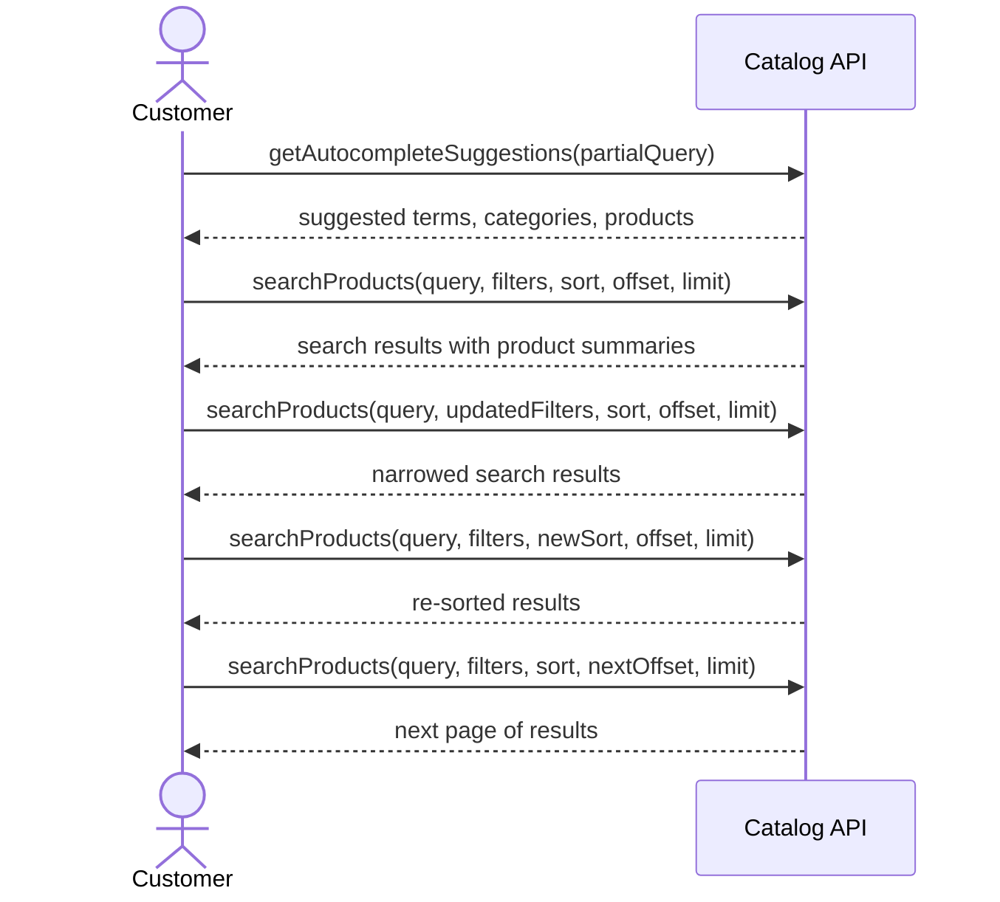
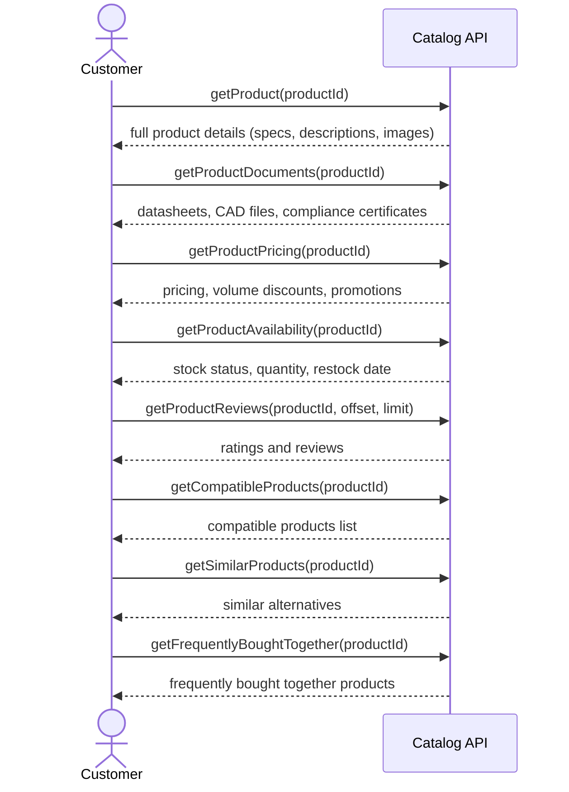
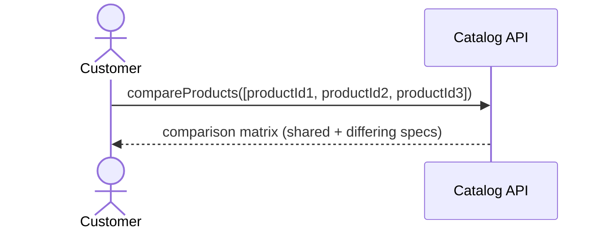
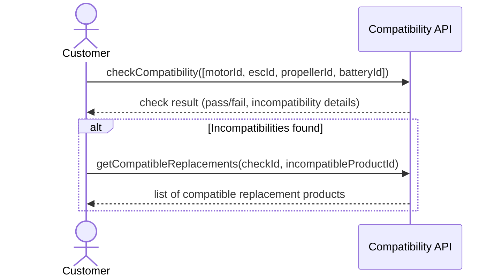
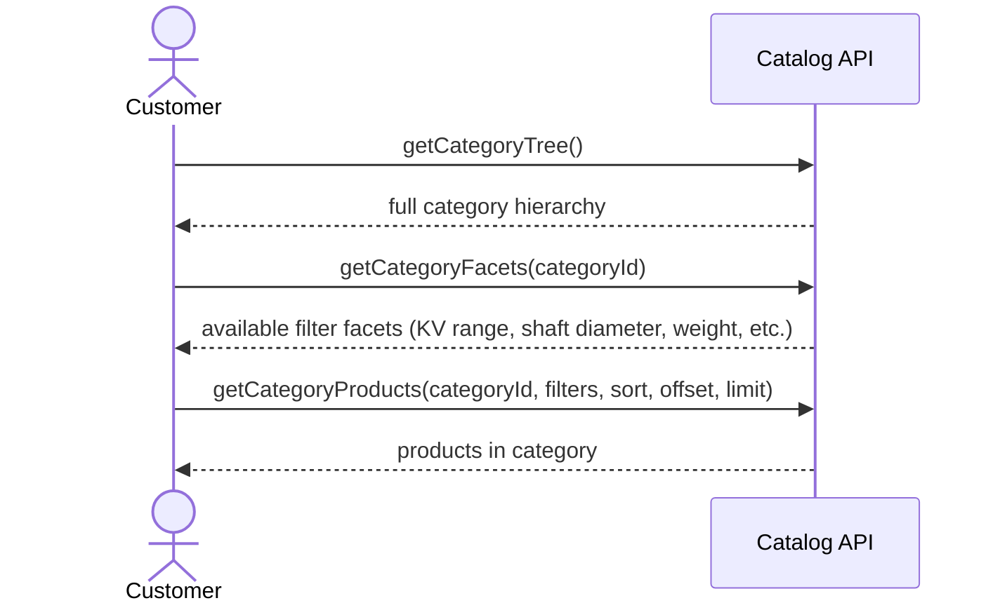
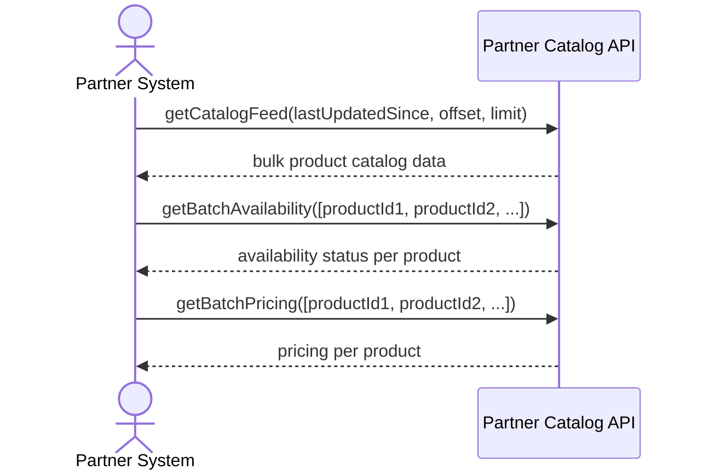

# Catalog Storefront — Sequence Diagrams

> **Phase:** ADDR — Define
> **Status:** Draft

---

## JS1: Product Discovery

## JS2: Product Evaluation

## JS3: Product Comparison

## JS4: Compatibility Verification

## JS5: Catalog Browsing

## JS6: Partner Catalog Access

