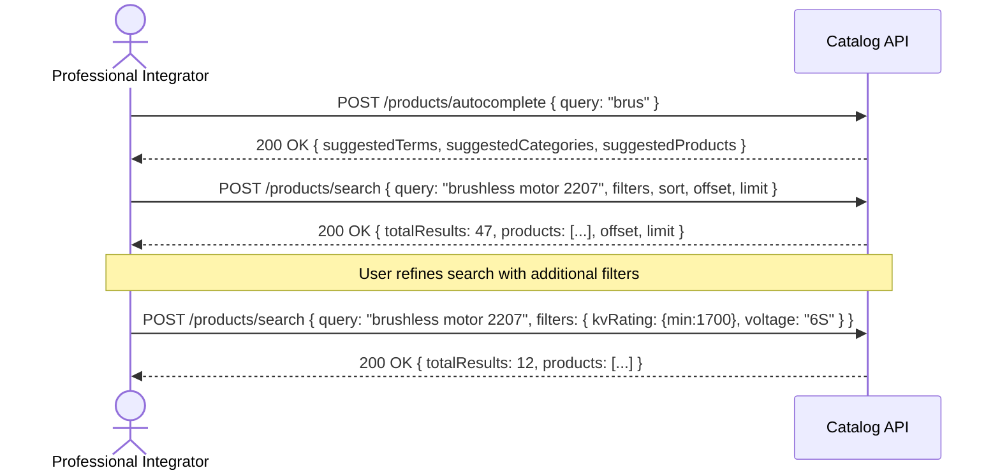
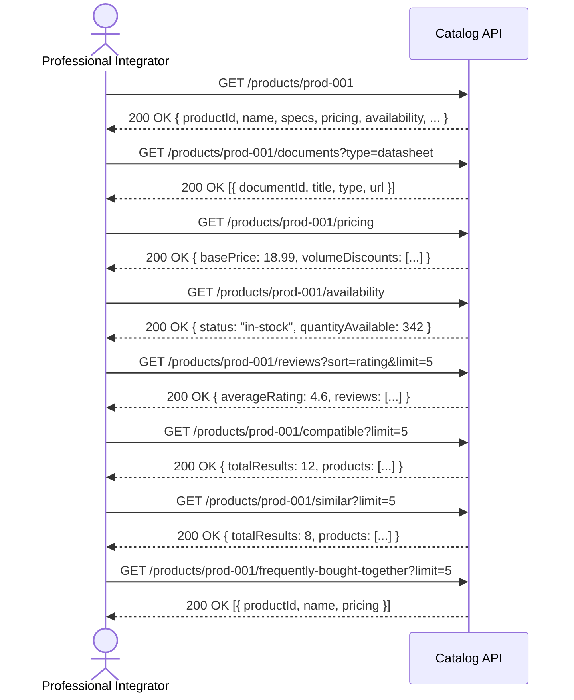
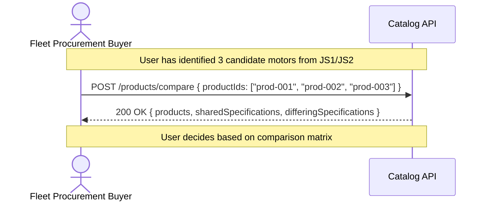
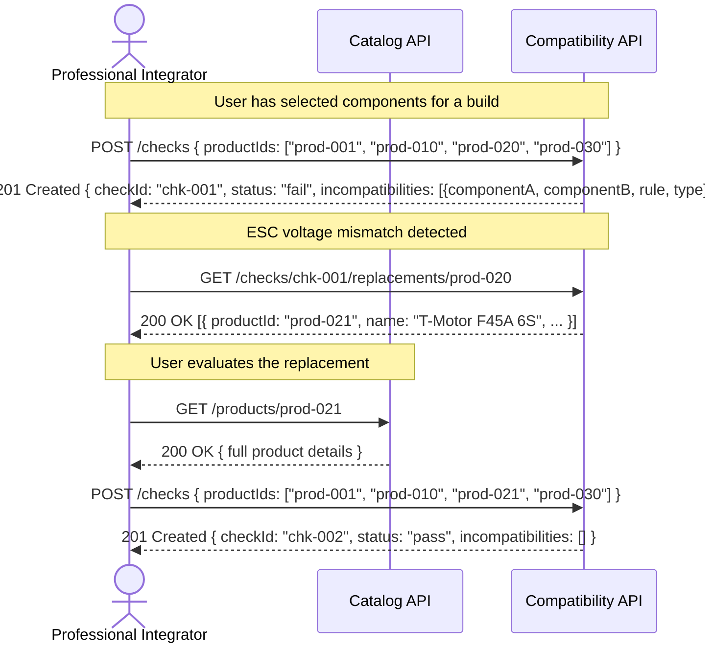
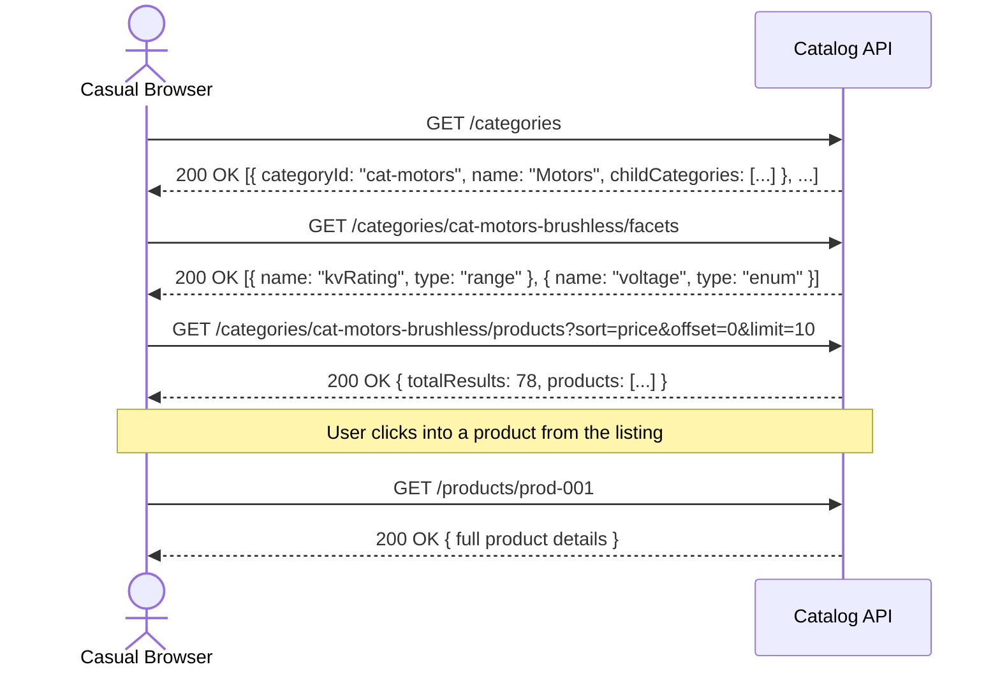
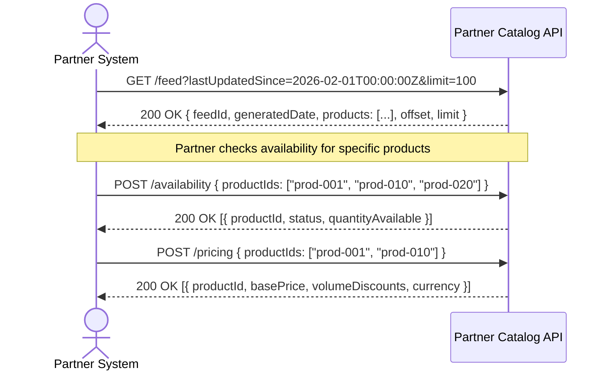

# Catalog Storefront — Sequence Diagrams (HTTP)

> **Phase:** ADDR — Refine
> **Format:** Mermaid sequence diagrams with HTTP methods and status codes
>
> **Note:** Product and check IDs are abbreviated for diagram readability. See the OpenAPI specs for full UUID examples.

---

## JS1: Product Discovery

---

## JS2: Product Evaluation

---

## JS3: Product Comparison

---

## JS4: Compatibility Verification

---

## JS5: Catalog Browsing

---

## JS6: Partner Catalog Access

