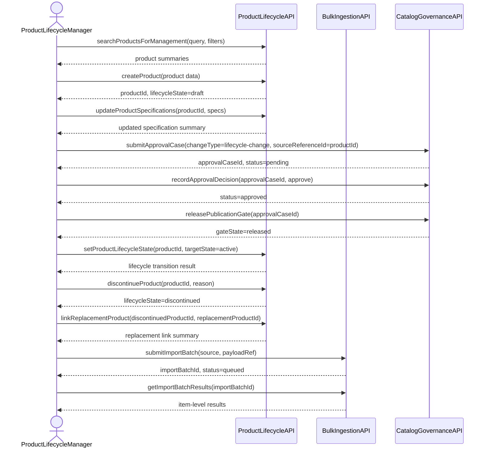
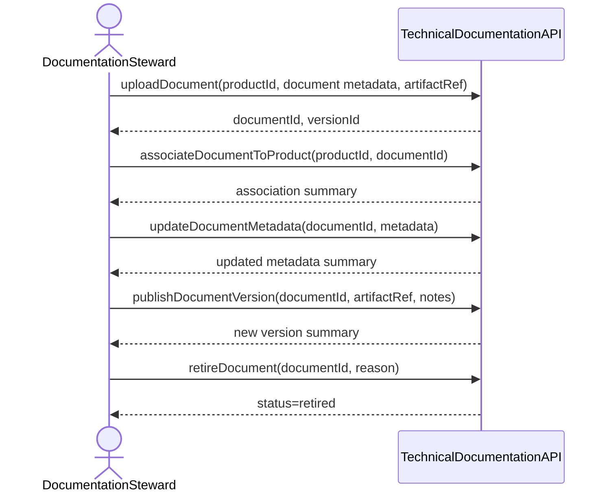
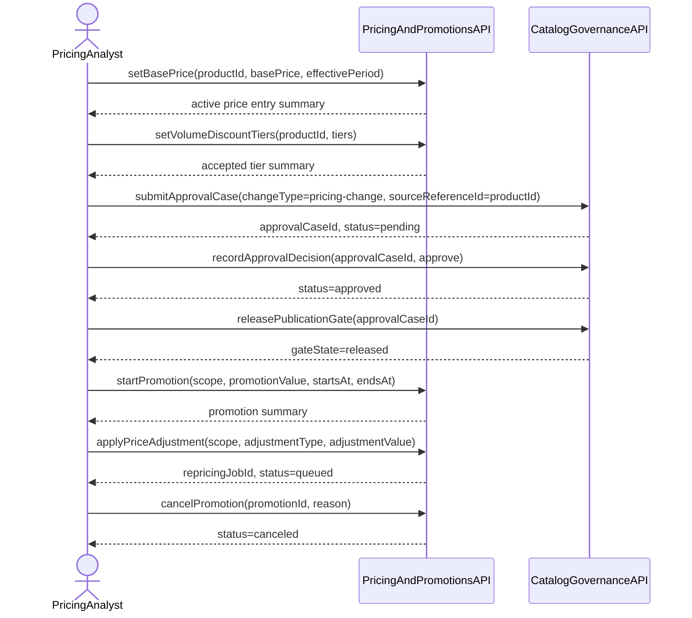
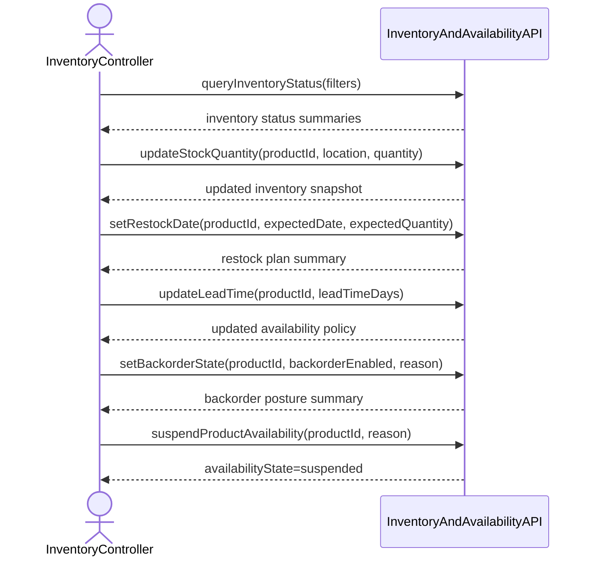
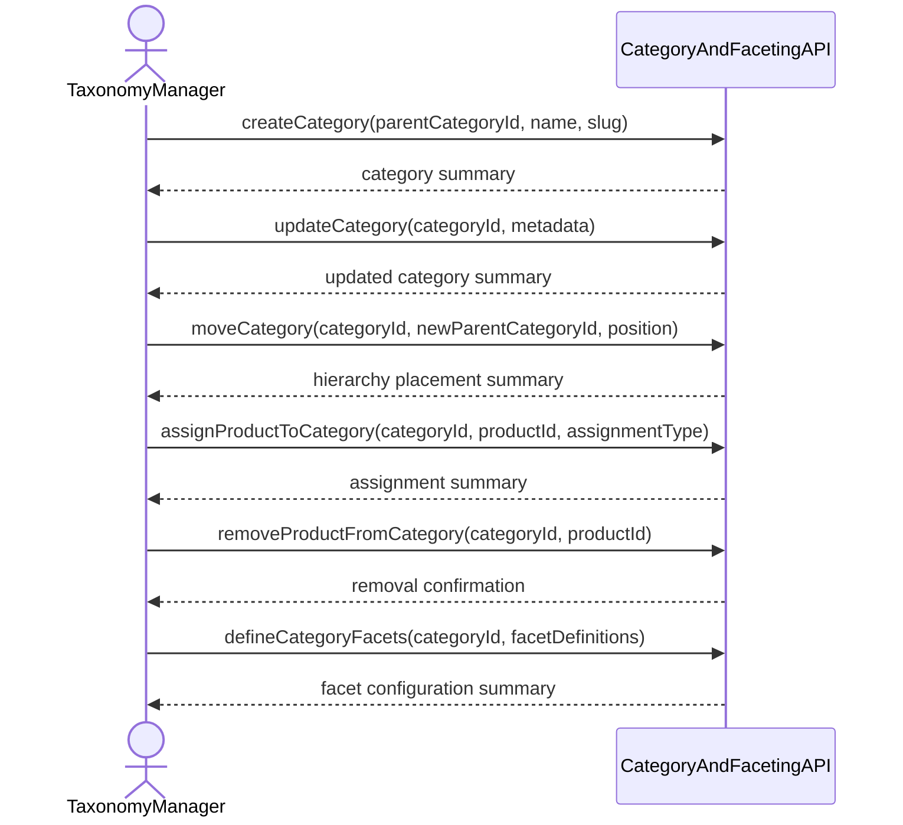
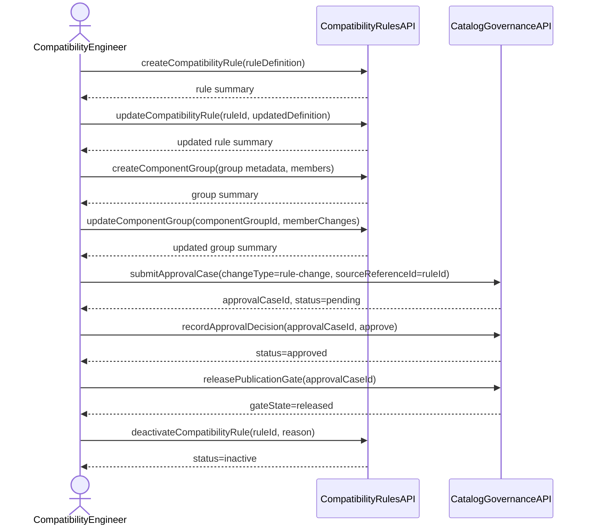

# Catalog Management v2 — Sequence Diagrams

> **Phase:** ADDR — Define
> **Status:** Draft

---

## JS1: Product Lifecycle Management

## JS2: Technical Documentation Management

## JS3: Pricing and Promotions Management

## JS4: Inventory and Availability Management

## JS5: Category and Faceting Management

## JS6: Compatibility Rules Management

