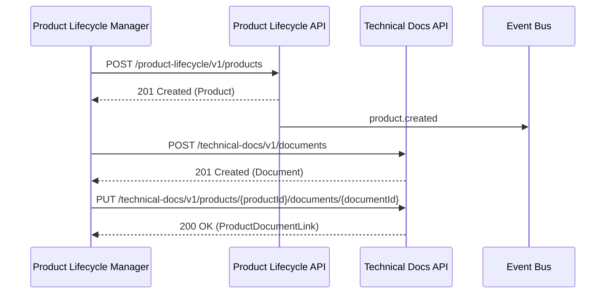
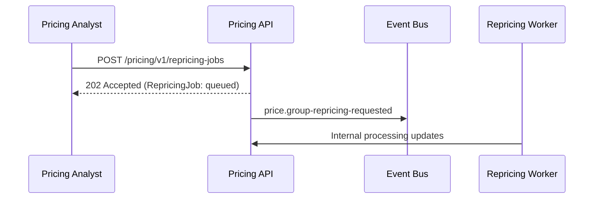
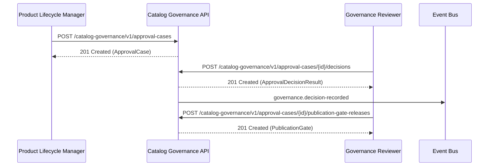
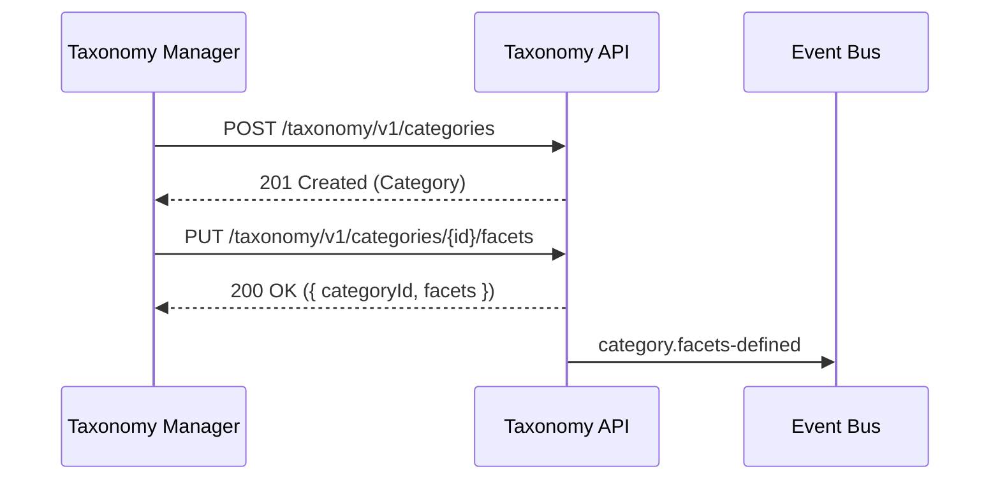
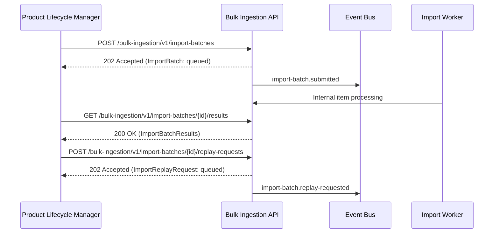

# Catalog Management v2 — Sequence Diagrams

## JS1/JS2: Create Product and Attach Documentation

## JS3: Repricing Flow (Async)

## JS4: Approval Case and Publication Gate

## JS5: Taxonomy and Facet Management

## JS6: Bulk Ingestion and Replay

